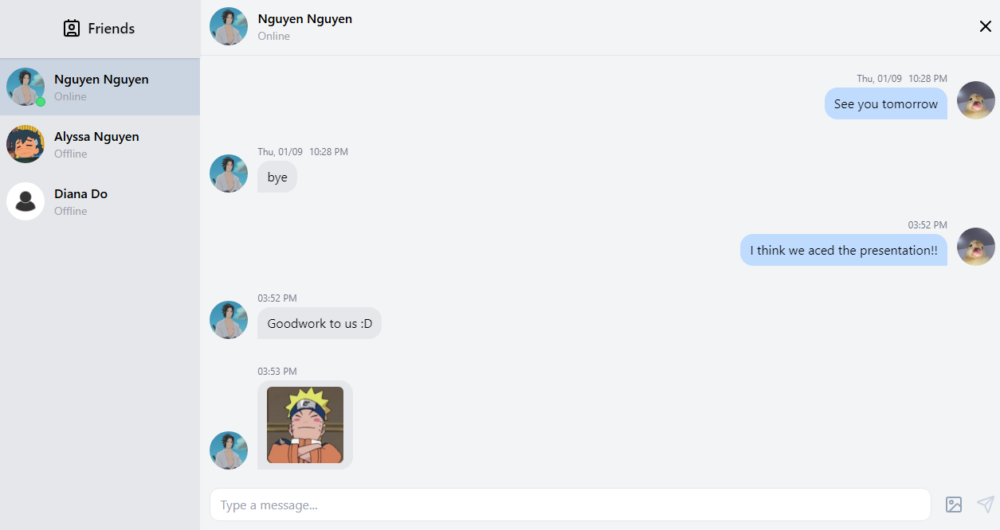

<h1 align="center">Talket Out 💬</h1>

    

<h2 align="left">About 💡</h2>

Talket Out is a web application built for real-time communication and collaboration. It features secure user authentication and authorization, live messaging with online status updates, and dynamic profile management. Users can update their profiles and enjoy a fully responsive design optimized for all devices. This platform is ideal for personal use or as a tool for team collaboration and staying connected.

<h2 align="left">Technologies Used ⚙️</h2>

  
  
  
  
  
  
  
  
  
  
  

